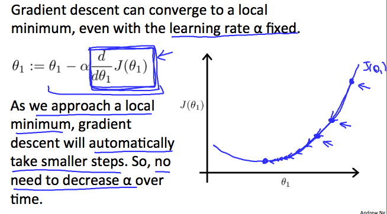

# Week1

# Introduction
## What is Machine Lerning
https://www.coursera.org/learn/machine-learning/lecture/Ujm7v/what-is-machine-learning

* 機械学習とは何か

アーサー・サミュエル(1959)：チェッカーゲームのプログラムを機械学習で作成
> コンピュータに明示的にプログラムすることなく学習する能力を与える研究分野だと定義

トム・ミッシェル(1998)
> コンピュータ・プログラムは、ある課題 T について、 ある性能基準 P に基づき、もし T についての性能が基準 P で測定して、経験 E と共に改善している場合に、 経験 E から学習したと言うことが出来る。

と、している。
つまり

* 課題T：解決したい問題(Task)
* 性能基準P：解決力(Performance)
* 経験E：経験|学習(Experience)

例えば「スパムメールフィルタ」を例にした場合

* T：スパムメールをスパムと非スパムに分ける(classify)
* P：正しく分類された電子メールの比率
* E：ユーザーがスパムと非スパムにラベル分けするのを見る

になる。

## Supervised Learning(教師あり学習)

* Supervised Learningとは

> データセット(学習データ)を事前に与えて学習させ、次のインプットとアウトプット(結果)の関係性(正しさ)を評価するもの

* 回帰と分類

> 回帰(Regression)：結果が連続値になるものに用いる 
> 例えば住宅の広さごとの価格帯がどう関係するか、や、商品がリリースから3ヵ月で何個売れるか、など。

> 分類(Classification)：結果が離散値(0か1)になるものに用いる 
> 例えば、腫瘍のサイズごとに良性か悪性か、や、合格か不合格か、など。

> Exapmle： 
> (a) Regression - Given a picture of a person, we have to predict their age on the basis of the given picture 
> (b) Classification - Given a patient with a tumor, we have to predict whether the tumor is malignant or benign.

## Unsupervised Learning(教師なし学習)

* Unsupervised Learningとは

> 事前にラベリングされたデータセットを与えず、単にデータセットの中から関係性や構造を見出しクラスタリングするもの

* クラスタリング

> 例えば、製品の利用ユーザーの年齢データを与えて、ユーザーをいくつかのグループ(クラスタ)に分ける、など 
> この場合「タイプ1」「タイプ2」などのグループ定義は事前に行われず(教師なし)、クラスタリング・アルゴリズムによってクラスタ分けする。 
> 他にも、例えばニュースの本文データを見て、類似のニュースに分類する、など。

## 小テスト

ここまでの復習をやった。全5問、満点

# Model and Cost Function

* よく使うシンボルとその意味

> m：データセット 
> i：データセットの添字、乗数ではないので注意 
> x：入力値 
> y：出力値 
> h：学習によって出力された関数、hypothesis(仮説)の略。hはxを受け取り、yを出力する

* 線形回帰(Linear Regression)または単回帰(Simple linear regression / One variable regression)

> hθ(x) = θ*0 + θ*1x 
> みたいに表現する。 
> 変数がx1つしか無いので単回帰とよばれ、表にした時にはシンプルな線形になる。

## Cost Function(目的関数)

* 目的関数とは

線形回帰において、実際のデータに対して最適な直線を導く関数。 
つまり、hypothesisを導く為の関数である。

> J：目的関数

 二重誤差関数

hθ(x)と実際の値yの差のi=1〜mまでの総和を2乗して2mで割る、というものらしい

* hθ(x)とJ(θ1)の関係を見ながらJが何をしているかを確認

> 単純にするためにθ0＝0にしてθ1xの部分だけにする 

> hθ(x)が1の時、実際の値yは1、Jを計算すると、θ1=1になる。
> グラフ上のX印が実際の値で、線分がhθ(x)の線。

> 今度はhθ(x)が0.5の時、θ1は0.583333...になる

> 今度はhθ(x)が0の時、θ1は2.33333...になる 
> 目的関数の目的はJ(θ1)を最小化する事になるが、最小化とはこの曲線の1の部分(実際の値yとの差分が最小)という事になる

* θ0を0として簡略化していたが、θ0とθ1の両方が入るとこうなる

> 次元が一つ増え、立体的な図になる(上図では等高線になっている) 

# Parameter Learning

## Gradient descent(最急降下法)

> θ0,θ1を最小化するためのアルゴリズムの一つ 
> 図のようにθ0,θ1がある時に、まずある地点を決めて(初期化という)、そこより小さい値を探してどんどん探索していく。 
> 初期値(図の赤丸で囲われた点)によって、最小値が変わる特徴がある。局所的最小値、という 
> 通常、初期値は0で始める

> 問題を単純にするため、θ1のみをつかって次元を下げてみる 

> :=　コロン、イコールで代入を表す。=の場合は真の表現 
> α：最急降下法の学習率。値が小さいほど、ステップが増え、大きすぎると最小値を通り過ぎてしまう(収束しない、発散する、という)。 

> 最小値より右に値がある場合、導関数はマイナスの方向に向かう値を返す 
> 逆に左にある場合はプラスの方向に向かう値を返す 
> αはステップの幅に影響する。

* 初期値が最小値だった場合どうなるか？

> αの右にある導関数部分は微分。最小値より遠ければ遠いほど勾配がきつくなり、ステップの幅が広がる。 
> 最小値に近くにつれて導関数が0に近づき、最終的には θ1 ＝ θ1-α*0 となり、移動をやめる。 

## 小テスト

ここまでの復習。全5問、満点
英語が難しくて、選択問題でなんどもひっかかった・・・

# Linear Algebra Review(線形代数レビュー)

## Matrix(行列)

* 行列とは配列である
* 行(row)×列(column)の順で書く。4×3の行列、のように。添字の順番もそうなる。
* ベクトルとは1列しかない行列である。n×1の行列。

## Addition and Scalar Multiplication(加算とスカラー乗算)

### 加算

* 行列の各項目を足すだけ。A32+B32の行列の場合は、A11とB11を足してC11に、A21とB21を足してC21に...を繰り返してC32を求める。
* 同じ次元の行列どうししか加算できない。3×2の行列には3×2の行列しか加算できない。
* 計算結果は同じ次元の行列になる。

### 乗算
#### 行列×実数の場合
* スカラー乗算のスカラーとは「実数」という意味
* 実数と行列の掛け算は行列の各項に実数をかけるだけ
* 除算も同じく

#### 行列×行列の場合
* 前提としてA×B、AとBがそれぞれ行列の場合、Aの列数とBの行数が同じでなければならない
* A23×B31の場合、A11×B11 + A12×B21 = C11、以降を繰り返してC31の行列が出来上がる
* m×nの行列とn×oの行列の場合、n×oの行列になる
* 実数の掛け算と違い、A×B ≠ B×Aなので注意
* ただし、A×I = I×Aとなる場合があり、Iがn×nの場合である(と書いたけど恐らく英語の聞き取り漏れで、単位行列というやつの場合だと思われる)
* eye関数とかでググると出てくる。正方行列(行と列の数がイコールのもの。3×3とか4×4とか)、かつ0,0番目からn,n番目までの対角線のみが1であとは0の行列

#### Inverse and Transpose　逆行列と転置
* 1="identify"と言い特別な数字。1に何をかけても、かけた数字自体にしかならない。
* この逆(Inderse)で、何かにかけると1になる数字を逆数と言う
* 0は逆数を持たない。
* 3の逆数は3の-1乗(1/3、三分の一と同じ)
* 行列の場合も逆行列をかけると、↑の正方行列(eye?)が出来上がる
* 行列の全ての要素が0の行列は、同じく逆行列を持たない
* m×nの行列をn×mの行列に変換することを転置という。Aの転置をAT(Tは添字)と表して、Aの1行目をATの1列目にして2行目を2列目に...を繰り返す
* Aがm×nの行列の時、Aの転置、Bはn×m。その時Bのij番目の数は、Aのji番目の数字と一致する。

### 小テスト

ここまでのまとめテスト

. 
