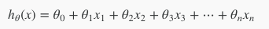
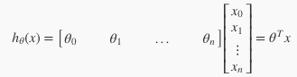

# Week2

## Octaveのインストール

インストールする

## Multiple Features/Multivariate Linear Regression(多変量の線形回帰)

* 1つの値から予測した線形回帰を複数の値から行う方法
* 今までの例で出てきた、家の広さ(x)から価格(y)を予測するものを、寝室の数(x2)、部屋の数(x3)、築年数(x4)、など複数の値から予想するモデルに
* 変数が4つになるので、x(2)括弧は添字なので、2番目のデータセット行列を指す事に注意

> 変数が複数ある場合のhθ(x)は上記のようになる。

> それを展開すると上図のようになる。 
> θを転置してxのデータセットと乗算すると最初の式を簡略化した物と同じだし、見通しが良い。

. 
