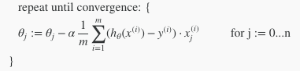

# Week2

## Octaveのインストール

インストールする

## Multiple Features/Multivariate Linear Regression(多変量の線形回帰)

* 1つの値から予測した線形回帰を複数の値から行う方法
* 今までの例で出てきた、家の広さ(x)から価格(y)を予測するものを、寝室の数(x2)、部屋の数(x3)、築年数(x4)、など複数の値から予想するモデルに
* 変数が4つになるので、x(2)括弧は添字なので、2番目のデータセット行列を指す事に注意

> 変数が複数ある場合のhθ(x)は上記のようになる。

> それを展開すると上図のようになる。 
> θを転置してxのデータセットと乗算すると最初の式を簡略化した物と同じだし、見通しが良い。

## Gradient Descent For Multiple Variables(多変量の最急降下法)

> こうなので

> こういうこと

## Gradient Descent in Practice I - Feature Scaling(変数のスケール)

* 多変量の最急降下法を扱うときのコツ
* 各変数が取りうる値の幅をできるだけ揃えておくと収束が早くなる
* 揃っていないと、等高線がいびつになり、局所的な最適解を見つけづらいため
* 具体的にはその変数の最大数で割って比率(0-1)の値に丸めといてやる(例では0-1の間にしてたけど、-1〜1の値にするのが一般的だとか)
* 他にもノーマライズする方法もあり、(x-平均値)÷最大値とする

## Gradient Descent in Practice II - Learning Rate(学習率)

* 最急降下法が正しく動いているかの確認は、イテレーション(ループ)回数をxにして、J(θ)の値の変化量をグラフにすると良い

* だいたい1回のイテレーションで変化量が10-3乗くらいだと、収束してると言って良いっぽい

* 回数を進めるごとに増えている場合や一度減って、また上がる、みたいなグラフの時は、学習率αの値が大きすぎる
* αが小さすぎると、収束に時間がかかる

## Features and Polynomial Regression

* 使う変数の選び方は自由。家の前の長さと家の奥行きで2つ使ってもいいし、家の面積で1つにしてもいい
* 家のサイズを複数使っても良い
* 二次関数にしてルート(平方根)使うと、いい感じの曲線ができるよ
* どの変数(フィーチャー)を使えば良いか、アルゴリズムで決める方法がある。次はこの紹介。

## Normal Equation(正規方程式)

* 最急降下法は複数のステップでθの局所的最適値を求めるが、Normal Equationは基本的に1ステップで出す
* その代わり実際のアルゴリズムとして実装方法だけを学ぶ
* 正規方程式を使う場合はフィーチャースケーリングはしなくて良い

* 正規方程式でやっていることは、Xの転置の逆行列にXの転置とyを掛けるだけ

* メリットとデメリット、要はサンプル数が1万くらいまでは正規方程式での計算は使えるが、それを越えると最急降下法じゃないと計算コストがあわなくなる

## 小テスト
英語がむずい、80%で通過

## Octava/Matlab Tutorial
## 小テスト
むずい、80%で通過

. 
