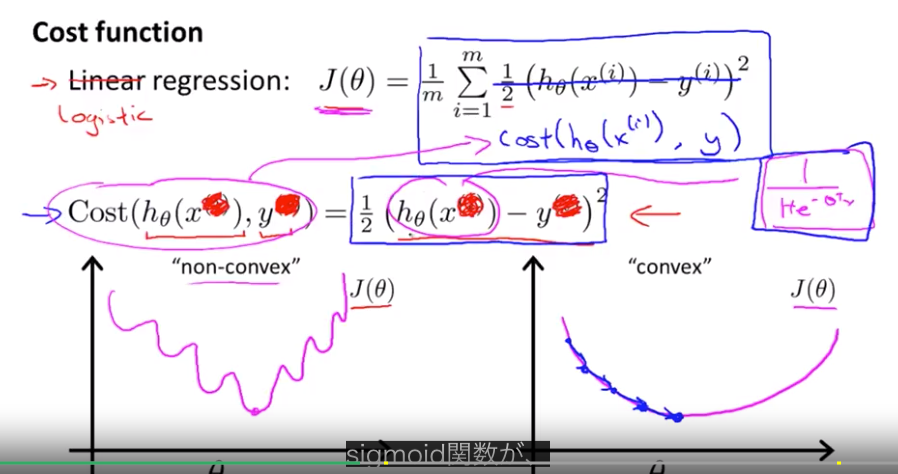
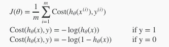
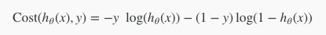

# week3

## Classification(分類)

### ロジスティック回帰アルゴリズム
* 分類問題はeメールがスパムかそうじゃないか、腫瘍が良性か悪性か、など
* yが0か1の2値で表される
* 0のものをネガティブクラス、1のものをポジティブクラス、という
* Sigmoid Function または Logistic Functionというアルゴリズム(呼び方が違うだけでどちらも同じもの)を使うと0と1の間の値を返すので、これを使う

* こんな感じになる
* P(y=1|x;θ)=0.7 みたいな書き方は「yが1である確率は70%」と読む

### Decision Boundary(決定境界)
* y=1とy=0になる境界線のこと
* ↑の図だと0.5

### Cost Function
* 線形回帰とは違い、ロジスティック回帰の場合はSigmoidFunctionを用いるため非凸型(non-convex)のグラフになる

* コスト関数

* y=1の時と0の時で違う

* 縦軸がコスト
* y=1の時は仮説が1になればコストは0になるが、仮説が0の時(y=1なのに仮説が0=間違っている時)コストは無限大になる

* 縦軸がコスト
* y=0の時は仮説が1(間違っている時)になればコストは無限大になるが、仮説が0の時コストは0になる

### Simplified Cost Function and Gradient Descent

* 日本語化されてないので辛い
* y=1の時と0の時でコスト関数が違うのを1つに圧縮する方法、みたいな感じ

* こうなる
* 最急降下法使う

### Advanced Optimization
* 最急降下法以外のコスト関数を最小化する方法もある
* 共役勾配法、BFGS、L-BFGSとか
* でもこのコースでは詳細はやらない。代わりに特徴を紹介
* 学習率αを手動で設定しなくて良い、最急降下法より早く収束する
* Octaveでの実装方法だけ紹介。

### Multiclass Classification: One-vs-all
* マルチクラスの分類問題とは
* eメールのタグづけなど、「仕事のメール」「家族からのメール」「趣味のメール」など複数のyがある時
* y=1,y=2,y=3などに分類したい時、y=1のデータとそれ以外を0としたデータ(2と3のデータを偽のデータに変える)を用意して単純な分類問題にすり替えて、y=1の時の決定境界を出してやる
* 分類したい数だけ分類機が出来上がるので、xが何かを推定するときはその分類機を全部試して一番確率が高くなったもの、と言えばよい

### 小テスト
クリアー

