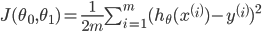

# What is Machine Lerning

https://www.coursera.org/learn/machine-learning/

スタンフォード大学のAndrew Ng先生がやっているオンライン講座。
課金すると修了証が出るらしいよ。

# Introduction
## What is Machine Lerning
https://www.coursera.org/learn/machine-learning/lecture/Ujm7v/what-is-machine-learning

* 機械学習とは何か

アーサー・サミュエル(1959)：チェッカーゲームのプログラムを機械学習で作成
> コンピュータに明示的にプログラムすることなく学習する能力を与える研究分野だと定義

トム・ミッシェル(1998)
> コンピュータ・プログラムは、ある課題 T について、 ある性能基準 P に基づき、もし T についての性能が基準 P で測定して、経験 E と共に改善している場合に、 経験 E から学習したと言うことが出来る。

と、している。
つまり

* 課題T：解決したい問題(Task)
* 性能基準P：解決力(Performance)
* 経験E：経験|学習(Experience)

例えば「スパムメールフィルタ」を例にした場合

* T：スパムメールをスパムと非スパムに分ける(classify)
* P：正しく分類された電子メールの比率
* E：ユーザーがスパムと非スパムにラベル分けするのを見る

になる。

## Supervised Learning(教師あり学習)

* Supervised Learningとは

> データセット(学習データ)を事前に与えて学習させ、次のインプットとアウトプット(結果)の関係性(正しさ)を評価するもの

* 回帰と分類

> 回帰(Regression)：結果が連続値になるものに用いる 
> 例えば住宅の広さごとの価格帯がどう関係するか、や、商品がリリースから3ヵ月で何個売れるか、など。

> 分類(Classification)：結果が離散値(0か1)になるものに用いる 
> 例えば、腫瘍のサイズごとに良性か悪性か、や、合格か不合格か、など。

> Exapmle： 
> (a) Regression - Given a picture of a person, we have to predict their age on the basis of the given picture 
> (b) Classification - Given a patient with a tumor, we have to predict whether the tumor is malignant or benign.

## Unsupervised Learning(教師なし学習)

* Unsupervised Learningとは

> 事前にラベリングされたデータセットを与えず、単にデータセットの中から関係性や構造を見出しクラスタリングするもの

* クラスタリング

> 例えば、製品の利用ユーザーの年齢データを与えて、ユーザーをいくつかのグループ(クラスタ)に分ける、など 
> この場合「タイプ1」「タイプ2」などのグループ定義は事前に行われず(教師なし)、クラスタリング・アルゴリズムによってクラスタ分けする。 
> 他にも、例えばニュースの本文データを見て、類似のニュースに分類する、など。

## 小テスト

ここまでの復習をやった。全5問、満点

# Model and Cost Function

* よく使うシンボルとその意味

> m：データセット 
> i：データセットの添字、乗数ではないので注意 
> x：入力値 
> y：出力値 
> h：学習によって出力された関数、hypothesis(仮説)の略。hはxを受け取り、yを出力する

* 線形回帰(Linear Regression)または単回帰(Simple linear regression / One variable regression)

> hθ(x) = θ*0 + θ*1x 
> みたいに表現する。 
> 変数がx1つしか無いので単回帰とよばれ、表にした時にはシンプルな線形になる。

## Cost Function(目的関数)

* 目的関数とは

線形回帰において、実際のデータに対して最適な直線を導く関数。 
つまり、hypothesisを導く為の関数である。

> J：目的関数

 二重誤差関数

hθ(x)と実際の値yの差のi=1〜mまでの総和を2乗して2mで割る、というものらしい

* hθ(x)とJ(θ1)の関係を見ながらJが何をしているかを確認

> 単純にするためにθ0＝0にしてθ1xの部分だけにする 

> hθ(x)が1の時、実際の値yは1、Jを計算すると、θ1=1になる。
> グラフ上のX印が実際の値で、線分がhθ(x)の線。

> 今度はhθ(x)が0.5の時、θ1は0.583333...になる

> 今度はhθ(x)が0の時、θ1は2.33333...になる 
> 目的関数の目的はJ(θ1)を最小化する事になるが、最小化とはこの曲線の1の部分(実際の値yとの差分が最小)という事になる

* θ0を0として簡略化していたが、θ0とθ1の両方が入るとこうなる

> 次元が一つ増え、立体的な図になる(上図では等高線になっている) 

# Parameter Learning

## Gradient descent(最急降下法)

. 